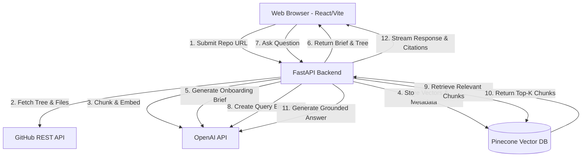

# System Architecture: CodeCompass

This document outlines the high-level architecture, component interactions, and data flow for CodeCompass v1.0.

## 1. High-Level Component Diagram

## 2. Request Lifecycle

### Ingestion Flow (`POST /api/ingest`)
1. **Request:** Frontend sends `{ "repo_url": "..." }`.
2. **Validation:** Backend verifies URL format and ensures it's a public repository.
3. **Fetching:** Backend calls GitHub API to fetch the repository tree. It filters out unsupported files (`.md`, `.py`, `.js`, `.ts` are kept; images, binaries, `node_modules` are dropped). It enforces the < 200 files limit.
4. **Code Retrieval:** Backend fetches raw content for all valid files.
5. **Processing:** The Chunker Service parses files into semantic blocks (functions/classes) and attaches metadata (file path, line numbers).
6. **Embedding:** The chunks are sent to OpenAI (`text-embedding-3-small`) to generate vectors.
7. **Storage:** Vectors and metadata are upserted into Pinecone.
8. **Summarization:** Concurrently, the README and file tree are sent to GPT-4o-mini to generate the Onboarding Brief.
9. **Response:** Backend returns the Onboarding Brief and the JSON File Tree to the frontend.

### Chat Flow (`POST /api/chat`)
1. **Request:** Frontend sends `{ "repo_url": "...", "query": "..." }`.
2. **Retrieval:** Backend embeds the query and searches Pinecone for the top 5-10 most similar code chunks matching the `repo_url` metadata.
3. **Prompt Construction:** Backend builds a system prompt containing the user query and the retrieved code chunks (including their file paths).
4. **Generation:** GPT-4o streams the answer back, citing the specific file paths used.
5. **Response:** Backend streams the response to the frontend via Server-Sent Events (SSE).

## 3. Deployment Architecture
- **Frontend:** Deployed on **Vercel**. Provides global CDN, automatic SSL, and fast CI/CD from GitHub.
- **Backend:** Deployed on **Render** (Web Service). Easily runs FastAPI and handles Python dependencies.
- **External Dependencies:** OpenAI (LLM & Embeddings), Pinecone (Vector storage managed on their cloud).
