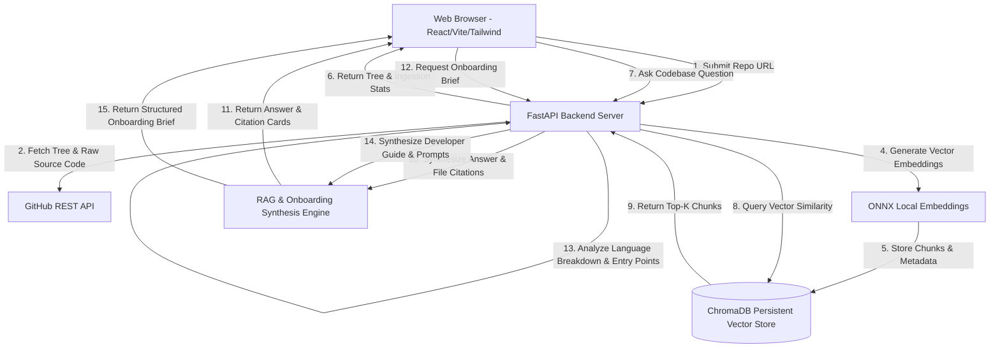

# System Architecture: CodeCompass

This document details the system architecture, component interactions, RAG data flow, and deployment topology for **CodeCompass**.

---

## 1. System Architecture Diagram

---

## 2. Component Design & Layer Responsibilities

### A. Frontend Presentation Layer (`frontend/src/`)
- **React 18 + Vite + Tailwind CSS + Lucide Icons:** Modern glassmorphism dark-mode UI with high-contrast slate hues and vibrant indigo/teal accents.
- **`App.jsx`:** Main container orchestrating global state, health ping, `Ctrl+K` keyboard shortcuts, view switcher (`Chat Intelligence` vs `Onboarding Brief`), and default interactive demo fallback state.
- **`FileTree.jsx`:** Collapsible directory tree component with search filter bar and language extension badges.
- **`Chat.jsx`:** Interactive messaging window displaying RAG response cards with expandable source file code citations and copy-to-clipboard feedback.
- **`OnboardingBrief.jsx`:** Tabbed interface rendering auto-generated repository documentation, language breakdown progress bars, entry point listings, and interactive prompt triggers.
- **Challenge Footer:** *"Built with Claude as part of the AB Talks 60-Day Claude AI Challenge."*

### B. Ingestion Engine (`backend/services/github_service.py`)
- Validates public GitHub repository URLs.
- Queries GitHub REST API for branch information and recursive file trees.
- Filters target source extensions (`.py`, `.js`, `.ts`, `.jsx`, `.tsx`, `.html`, `.css`, `.json`, `.md`, `.toml`).
- Ignores binary files, lockfiles, `.git`, `node_modules`, and `venv` directories.

### C. AST Code Chunker (`backend/services/chunker.py`)
- Uses LangChain's `RecursiveCharacterTextSplitter.from_language` to break code along syntax boundaries (functions, classes, blocks).
- Enriches every chunk with structural metadata: `file_path`, `language`, `repo`, `chunk_index`, `total_chunks`, `char_length`.

### D. Vector Database Layer (`backend/services/vector_db.py`)
- Persistent **ChromaDB** instance stored at `backend/chroma_db`.
- 100% free vector embeddings via local ONNX model (`all-MiniLM-L6-v2`), requiring zero paid API keys.
- Supports cosine distance similarity matching.

### E. RAG Intelligence Engine (`backend/services/rag_service.py`)
- Retrieves top matching code chunks from ChromaDB for user queries.
- Formats code context and synthesizes code-grounded explanations with file citations.
- Supports OpenAI (`OPENAI_API_KEY`), Gemini API (`GEMINI_API_KEY`), or a zero-cost local fallback synthesizer.

### F. Auto-Generated Onboarding Brief Engine (`backend/services/onboarding_service.py`)
- Analyzes repository file structure, detects primary entry points (`main.py`, `applications.py`, `App.jsx`), build manifests (`package.json`, `pyproject.toml`), and language distribution.
- Synthesizes a structured developer onboarding guide containing architecture breakdown, setup instructions, and 4 high-value exploration queries.

---

## 3. Deployment Topology

- **Backend API:** FastAPI application configured with `Procfile` & `render.yaml` for free cloud deployment on **Render**.
- **Frontend SPA:** Single-page React application configured with `vercel.json` for static CDN deployment on **Vercel**.
