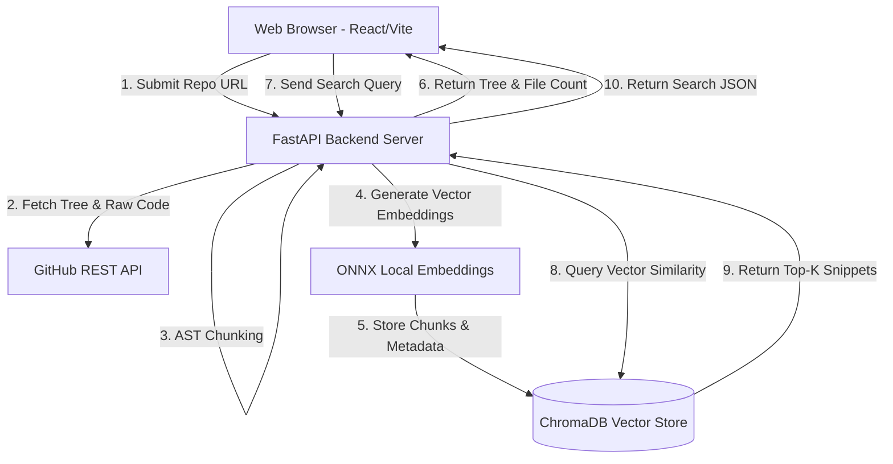

# System Architecture: CodeCompass

This document details the system architecture, component interactions, and data flow for CodeCompass.

---

## 1. System Architecture Diagram

---

## 2. Component Design

### A. Frontend Layer (React + Vite)
- User interface providing URL entry, repository tree navigation, and chat interactions.
- Communicates with FastAPI via HTTP REST calls (`/health`, `/api/ingest`, `/api/search`).

### B. Ingestion Engine (`github_service.py`)
- Validates public GitHub URLs.
- Queries GitHub REST API for branch information and recursive file trees.
- Filters out binary files, lockfiles, hidden directories, and enforces max file limits.

### C. AST Code Chunker (`chunker.py`)
- Utilizes LangChain's `RecursiveCharacterTextSplitter.from_language` to break source files along syntax boundaries (functions, classes, blocks).
- Enriches every chunk with structural metadata: `file_path`, `language`, `repo`, `chunk_index`, `total_chunks`, `char_length`.

### D. Vector Database Layer (`vector_db.py`)
- Uses persistent **ChromaDB** located at `backend/chroma_db`.
- Default embedding execution uses a local ONNX model (`all-MiniLM-L6-v2`), running 100% free with zero API key dependencies.
- Optional fallback to OpenAI `text-embedding-3-small` if `OPENAI_API_KEY` is specified.

---

## 3. Cloud Deployment Topography
- **Backend Service:** Hosted on **Render** (Free Web Service) using `backend/Procfile` & `backend/render.yaml`.
- **Frontend SPA:** Hosted on **Vercel** (Free Static CDN) using `frontend/vercel.json`.
